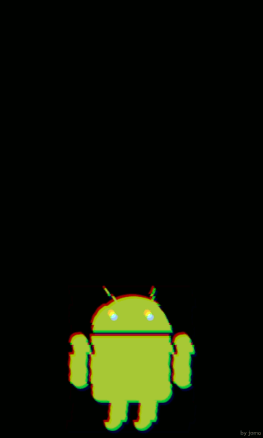

# glitchdroid



## Download

See [releases](https://github.com/jomo/glitchdroid/releases).

## Build

> Note: This is tailored for 768x1280 screens.

Drop [android.png](android.png) into [MOSH](https://getmosh.io).  
Use the controls on the site and set:

- Slices: slices = 45, offset = 0.008
- BadTV: thick = 2.9, fine = 2.3
- RGB Shift: amount = 0.008

Resize your browser so the `<canvas>` element is `384 x 640`.

Paste into console:
```JavaScript
var captures = [];

// create 40 screenshots with a delay of 100ms
new Array(40).join(",").split(",").forEach(function(a, i) {
  setTimeout(function() {
    captures.push(canvas.toDataURL());
  }, i * 100);
});

// wait for captures to finish
setTimeout(function(){

  // strip out URL parts
  for (var i = 0; i < captures.length; i++) {
    captures[i] = captures[i].split(",")[1];
  }

  // trailing new line
  captures.push("");

  // create new file
  var blob = new Blob([captures.join("\n")], {type : 'application/data'});

  // download
  window.open(URL.createObjectURL(blob));
}, 50*100);
```

Download and save the file as `base64-images.txt`.

Now run `build.sh` and check for extra images that can be removed to make the animation loop seamlessly.

Create the animation archive without compression:
```bash
zip -r0 bootanimation.zip desc.txt part0
```

Replace the existing boot animation:
```bash
adb root
adb remount
adb shell 'mv -iv /system/media/bootanimation.zip{,.bak}'
adb push -p bootanimation.zip /system/media/bootanimation.zip
```

That's it. Reboot to see the animation!